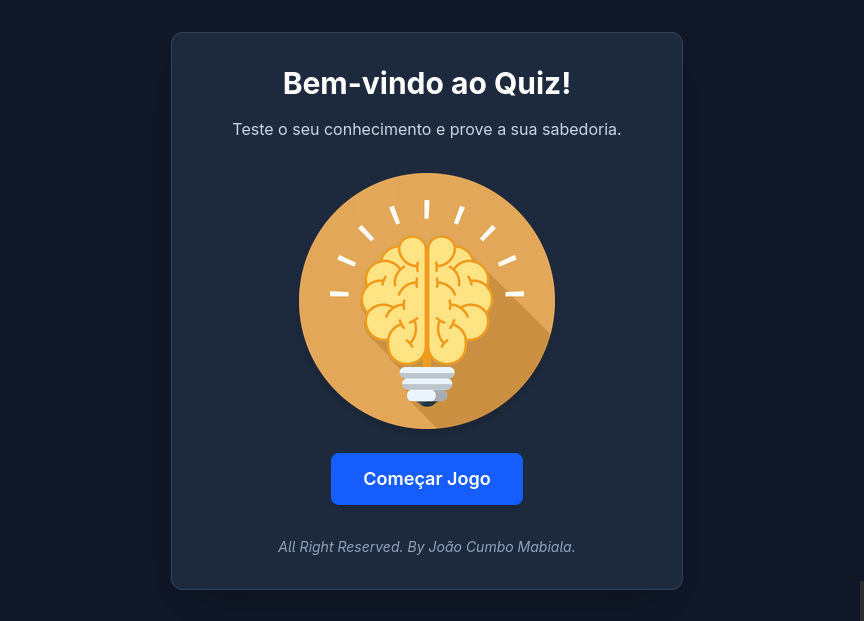
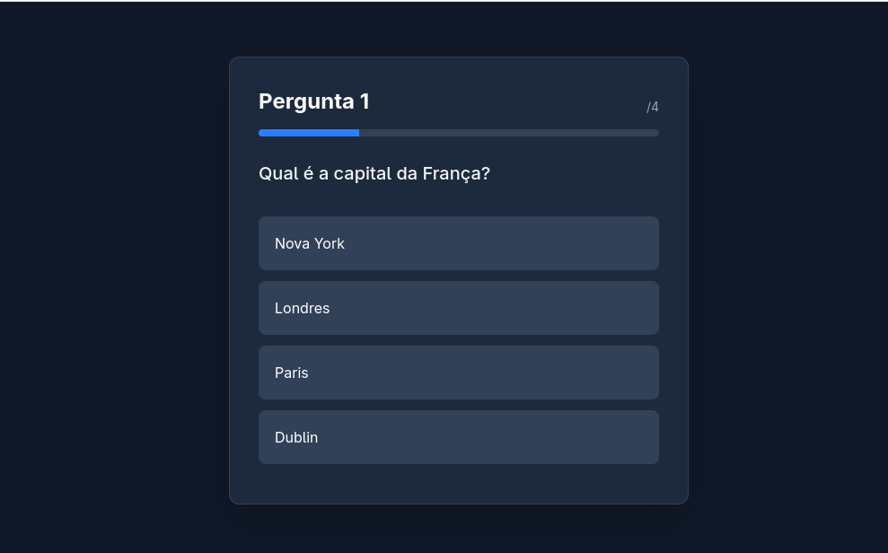
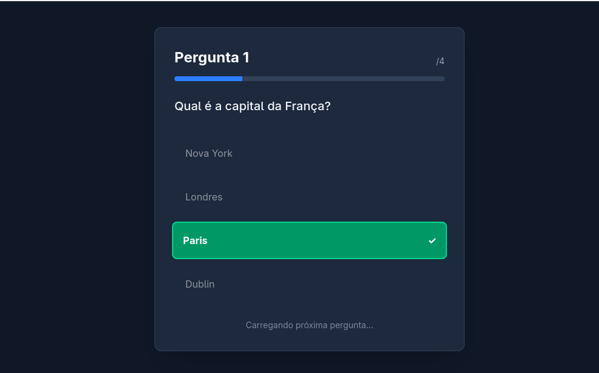
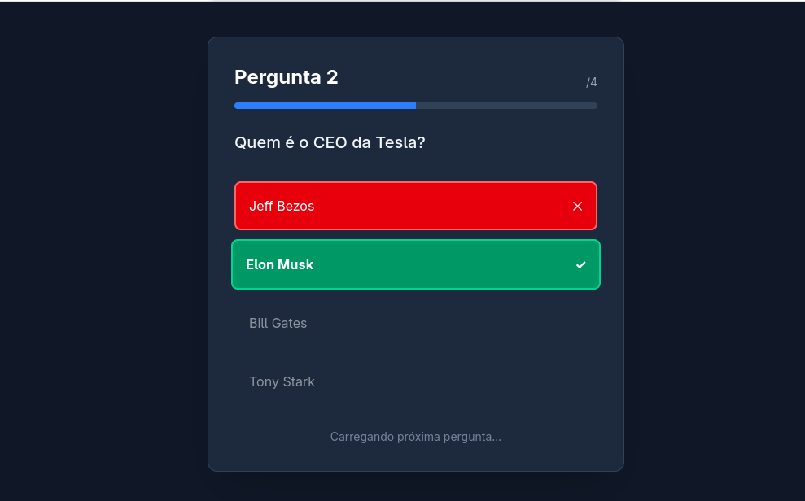
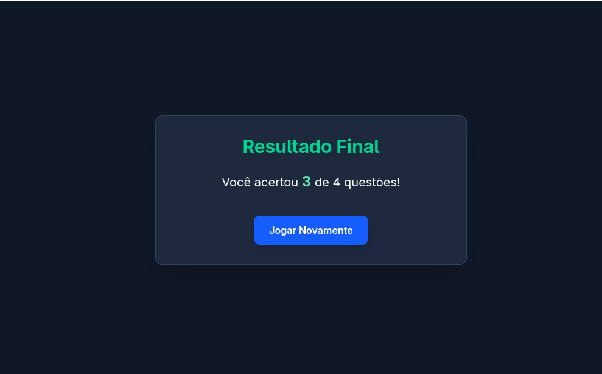

<h1 align="center">
     Jogo de Quiz 
</h1>
 <h2 align="center">
     Teste o seu conhecimento e descubra o quão inteligente você é. 
</h2>

 ## Este é um jogo de Perguntas e Respostas
 
 ## Foi desenvolvido em React, Typescript e Tailwindcss
 
 ## Características do Jogo:
 - Mostrar uma pergunta e várias opções de respostas
 - Resposta errada fica vermelha, resposta certa fica verde.
 - São no total 10 questões
 - Mostrar resultado final após o termino
 
### Tela Principal

### Respostas

### Resposta Certa

### Resposta Errada

### Resultado Final

